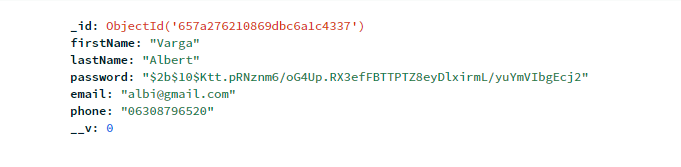
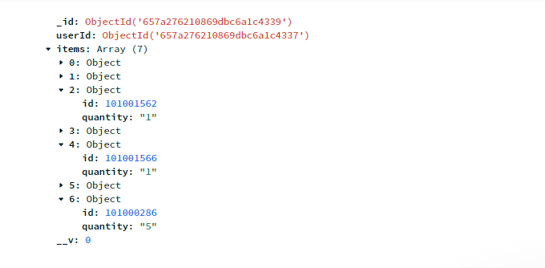
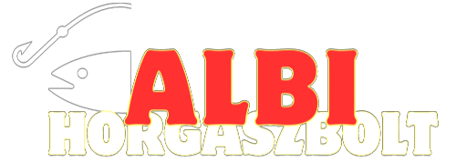

# Albi horgászbolt, E-commerce website project

**Albi horgászbolt webshop. Full MERN app, React Front end Express Back end részel, AZURE App Services hosting MongoDB connect. Több oldalas alkalmazás, több funkcióval, kategóriákkal szűrési feltételekkel funkcionális programozással reszponzíve dizájnnal.**

**https://albihorgaszbolt.azurewebsites.net/**

## Tech Stack

**Client** Typescript, React
**Client-Style** SASS SCSS, Reactstrap, Bootstrap 5
**Server** JavaScript, Node, Express
**Database** MongoDB
**Host** Azure App Services

## Irányelvek

- Context API
- Functional programming
- LocalStorage Data backup
- Reszponzív design
- Mobile first design
- Multi-page application
- Clean Code elvek, camelCase konvergencia
- Full stack alkalmazás
- Database acid elvek
- Server API
- Teljes perzisztencia

### React

A projektben használt React technologiák:

- npx create-react-app
- React hooks
- Context API
- React Router V6
- Components (functional)
- Typescript TSX
- Axios
- createContext, useContext, useState, useEffect, ReactNode
- onClick, onBlur, onKeyDown

### Typescript, JavaScript

A projektben használt Typescript, JavaScript technologiák:

- Tipusok: Egyszerű adattípusok, Összetett adattípusok
- type, interface
- localStorage
- függvények, map, filter, find, reduct, sort, Array.from, replace, toString, reverse, Number, String, Math.floor, localeCompare
- Spread operátor, destrukturálás
- elágazások if, switch, ternary operator
- async await, try catch

### Express Node.JS

A projektben használt Express Node.JS technologiák:

- jwt, bcrypt
- use, get, listen, post
- express.Router
- async await, try catch

### SCSS, Reactstrap, Bootstrap 5

A projektben használt SCSS, Reactstrap, Bootstrap 5 technologiák:

- @use, @mixin, @include, @media, @keyframes
- Flexbox, Grid, Positioning, Before-After
- variable: color, font-size, weight, media breakpoints
- css-reset
- Bootstrap Offcanvas
- Bootstrap Modals

### Mongoose

A projektben használt mongoose Bootstrap 5 technologiák:

- mongoose.model
- mongoose.Schema
- findOneAndUpdate
- findOne

**MongoDB users COLLECTIONS**

**MongoDB shopcards COLLECTIONS**

#### Felhasznált kód, elemek:

- https://azure.microsoft.com/hu-hu/
- https://www.mongodb.com/products/platform/cloud

- https://react-icons.github.io/react-icons
- https://react-bootstrap.netlify.app/
- https://getbootstrap.com/
- https://www.youtube.com/watch?v=lATafp15HWA&t=3103s
- https://www.canva.com/
- https://react-select.com/home
